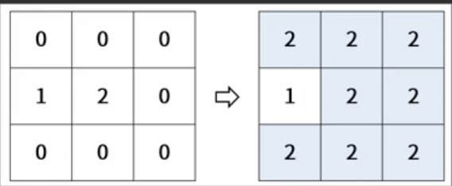
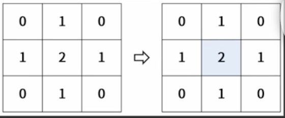

## 문제설명

- 도로의 특정 지점에서 물이 새고 있다. 도로를 2차원 배열로 구역을 나누고 다음과 같이 0, 1, 2로 정보를 표시하였다.
- 0은 정상 도로
- 1은 벽으로 막아둔 곳
- 2는 물이 새고 있는 지점

예를들어, 도로 상태가 아래 좌측과 같은 경우, 시간이 지나면 오른쪽과 같이 물이 퍼지게 된다.

이 때 벽은 정상 도로 위의 3곳에 설치할 수 있는데, 아래와 같이 설치한 경우는 물이 퍼지지 않게 되고, 이때 정상 도로는 네 군대가 남게 된다.


이와 같이 도로 상태가 주어졌을 때 벽을 세 군대 설치한 후, 물이 퍼지지 않은 정상 도로의 개수가 최대가 되는 값을 구하는 프로그램을 작성하시오.

## 입력 형식

도로 정보는 roads 2차원 배열로 주어지며, 행과 열의 크기가 각각 3이상 10이하의 자연수이다.

도로정보 내에 물이 새는 지점의수는 1이상 5이하의 자연수로 주어진다.

## 출력 형식

물이 퍼지지 않은 정상 도로의 최대 기수를 반환하세요.

## 입출력 예시

| roads                     | Result |
| ------------------------- | ------ |
| {{0,0,0},{1,2,0},{0,0,0}} | 4      |

```jsx
public class Practice3{
    public static int soultion(int[][] roads){
        return 0;
    }
    public void solution1{

    }
    public static void main(String[] args){
        int[][] roads = {{0,0,0},
                        {1,2,0},
                        {0,0,0}};
        System.out.println(solution(roads));

        roads = new int[][]{{2,0,0,0,1,1,0},
                            {0,0,1,0,1,0,0},
                            {0,1,1,0,1,0,0},
                            {0,1,0,1,1,0,0},
                            {0,0,0,0,0,1,1},
                            {0,0,0,0,0,0,0},
                            {0,0,0,0,1,2,0}};
        System.out.println(solution(roads));
    }
}
```
